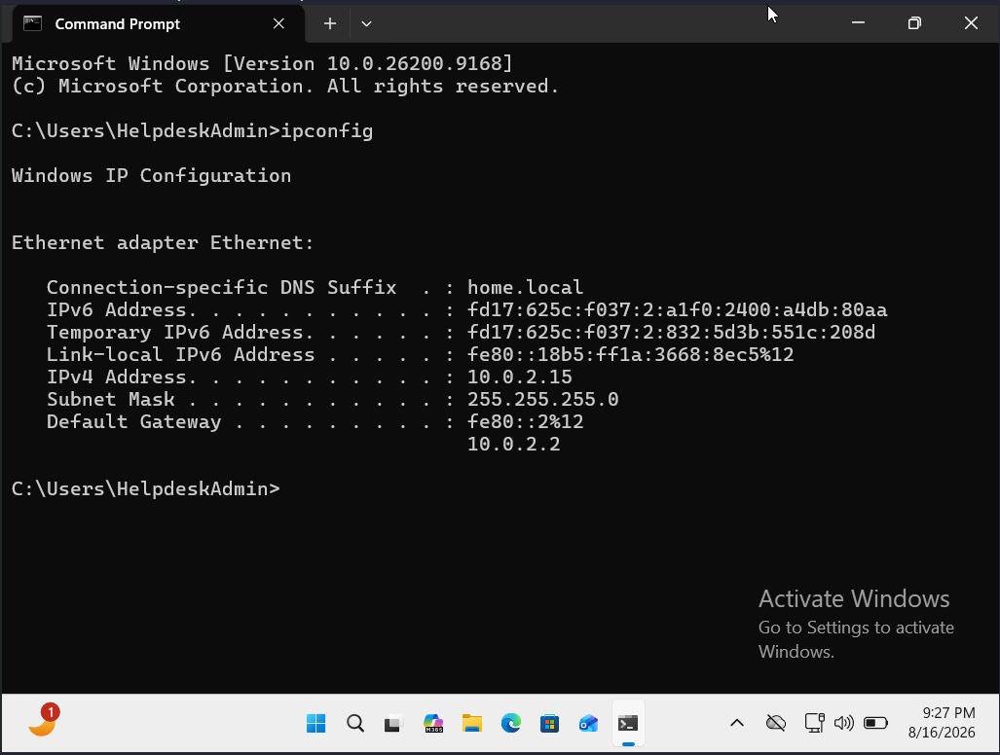
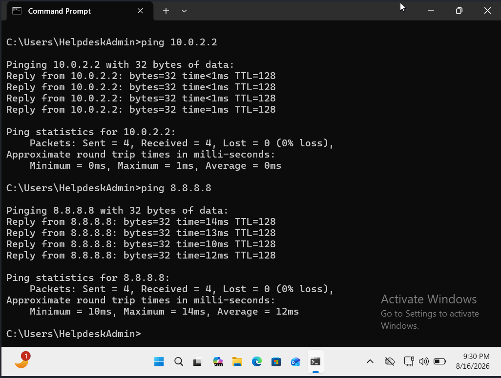
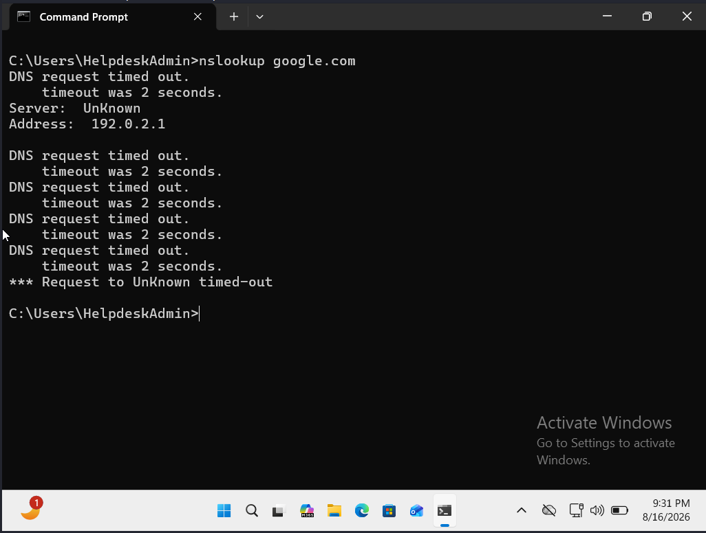
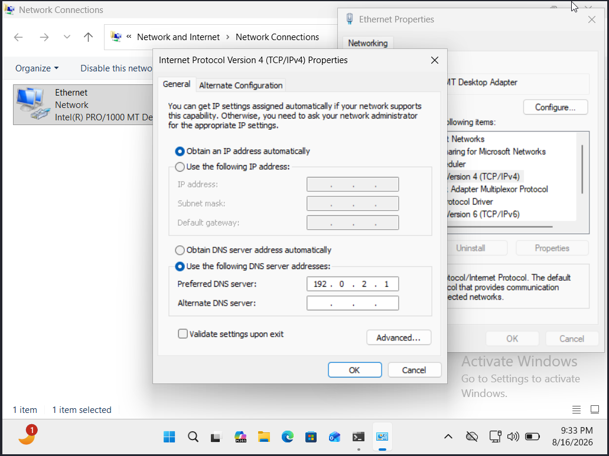
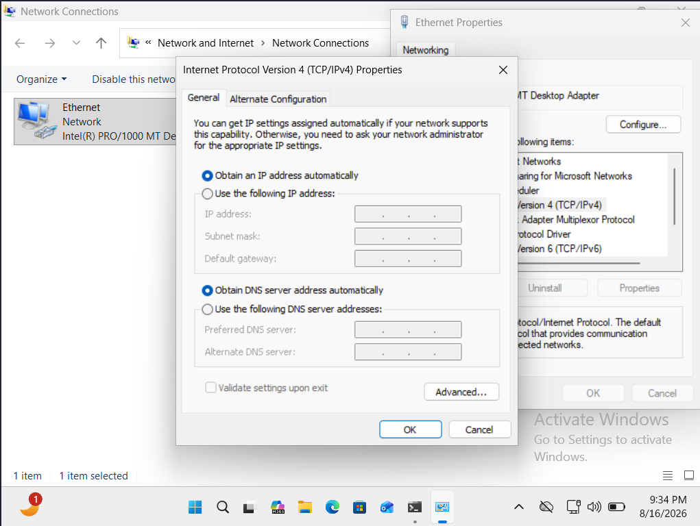
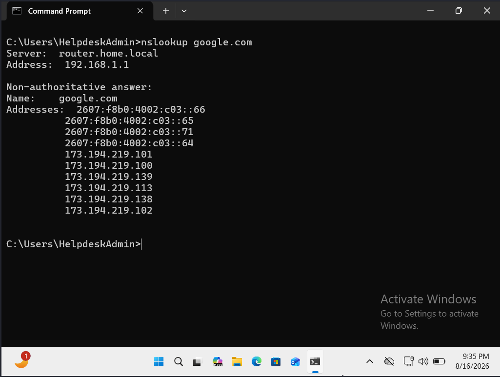

# Ticket 01: DNS Connectivity Troubleshooting

## Scenario
A simulated user reports that their Windows 11 workstation is connected to the network, but websites are not loading. The goal of this scenario is to identify the source of the connectivity problem, resolve the issue, and verify that service has been restored.

## Initial Assessment
The workstation appeared to have a network connection, but the user's report did not identify whether the problem was with local network connectivity, internet connectivity, DNS resolution, or the application itself. I began by testing each part of the connection individually to isolate the failure.

I reviewed the workstation's current IP configuration using 'ipconfig' to establish a baseline before beginning connectivity tests.

## Trouble Shooting Process
### 1. Tested Local Gateway Connectivity
I first tested whether the workstation could communicate with its default gateway.

'ping 10.0.2.2'

The gateway responded successfully with no packet loss. This indicated that the workstation could communicate with the gateway on the local network.

### 2. Tested Internet Connectivity by IP Address
After confirming connectivity to the default gateway, I tested whether the workstation could reach an external host by IP address.

'ping 8.8.8.8' 

The host responded successfully with no packet loss. This demonstrated that the workstation had external IP connectivity and narrowed the problem further.

### 3. Tested DNS Name Resolution
Since the workstation could reach the internet by IP address, I tested whether it could resolve a domain name through DNS.

'nslookup google.com'

The DNS request timed out. The output showed that the workstation was attempting to use '192.0.2.1' as its DNS server. This isolated the issue to DNS rather than general network connectivity.

## Diagnosis
The workstation had valid local and external network connectivity, but DNS name resolution was failing. The system had been configured to use an incorrect DNS server address ('192.0.2.1'), causing DNS requests to time out.

## Resolution
I opened the Windows network adapter configuration using 'ncpa.cpl' and reviewed the IPv4 properties for the Ethernet adapter. I changed the DNS configuration from the incorrect manually configured server back to obtaining the DNS server address automatically.

## Verification
After restoring the DNS configuration, I tested name resolution again using:

'nslookup google.com'

The lookup completed successfully and returned IP addresses for the domain, confirming that DNS resolution had been restored.

## Key Takeaway
Isolating the DNS issue was key here. By testing IP address connectivity vs. DNS resolution separately, I was able to quickly identify and resolve the DNS configuration issue.

