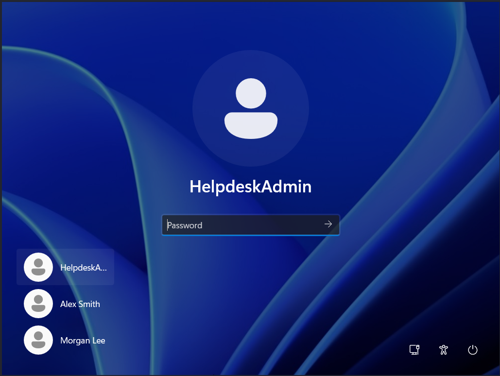
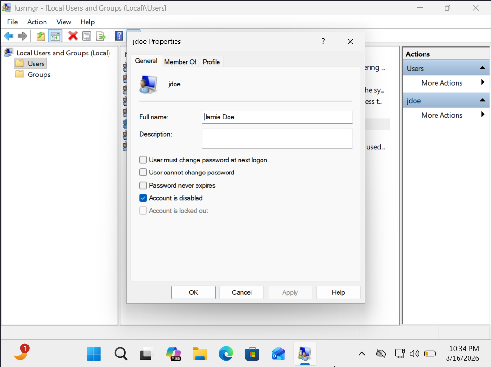
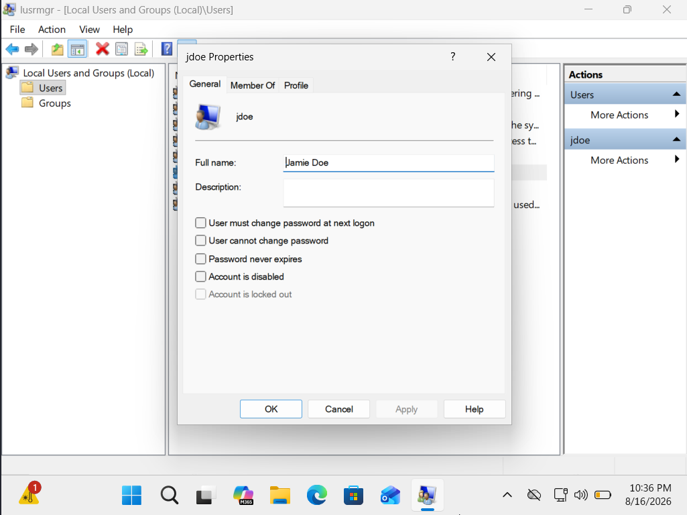
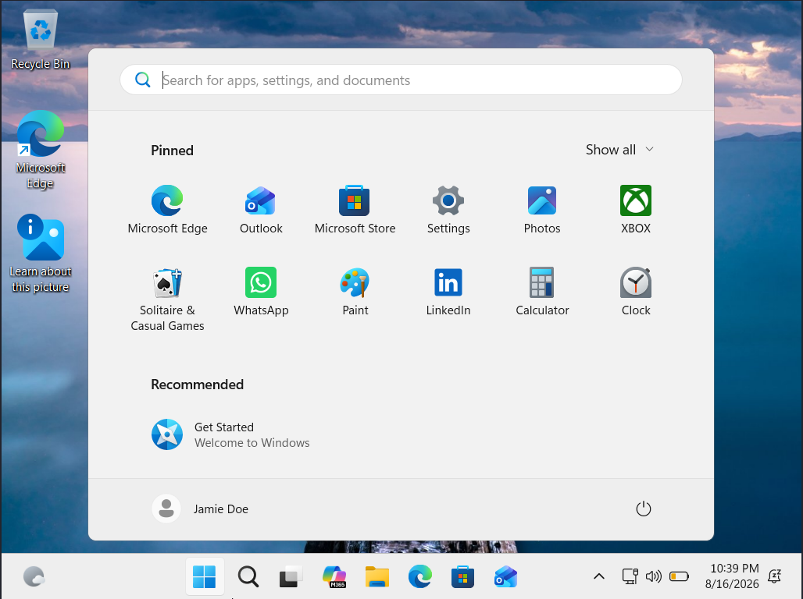
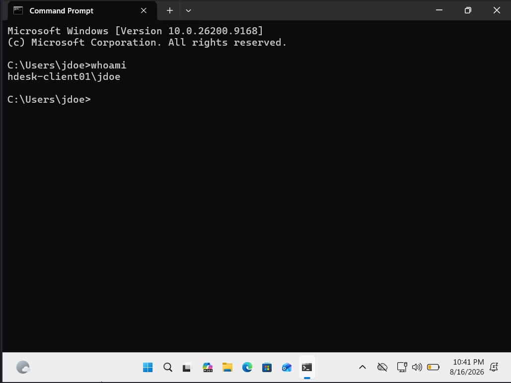

# Ticket 02: Disabled Windows User Account

## Scenario

A simulated user reports that they are unable to sign in to their Windows 11 workstation and their account is no longer visible as a sign-in option. Other local users remain available. The goal of this scenario is to determine why the issue is affecting a single user, restore account access, and verify that the user can successfully sign in.

## Initial Assessment

Because other local users remained available for sign-in while Jamie Doe's account was missing, I suspected the issue was specific to the affected user rather than a system-wide Windows login problem. I decided to inspect the local user account and its current status before making any changes.

## Observed User Issue

At the Windows sign-in screen, Jamie Doe was not listed as an available user, while other local user accounts remained available for sign-in.

## Troubleshooting Process
### 1. Inspected the Local User Account

Since other users were still available for sign-in, I investigated Jamie Doe's local account rather than treating the issue as a system-wide login failure.

I opened Local Users and Groups using:

'lusrmgr.msc'

I located the 'jdoe' account and opened its properties to inspect the account status.

### 2. Identified the Account Status

In the properties for 'jdoe', I found that **Account is disabled** was enabled. This explained why Jamie Doe was unavailable as a sign-in option while the other local users remained accessible.

## Diagnosis

The login issue was caused by the 'jdoe' local Windows account being disabled. Because the problem was isolated to Jamie Doe while other users remained available, no system-wide authentication or Windows issue was identified.

## Resolution

I opened the properties for the 'jdoe' account and unchecked **Account is disabled**. I then applied the change to restore the user's ability to sign in.

## Verification

After enabling the account, I signed out of the administrator account and confirmed that Jamie Doe was once again available as a Windows sign-in option. I then successfully signed in using the 'jdoe' account.

I verified the identity of the active Windows session using:

'whoami'

The command confirmed that the active session belonged to the restored user account.

## Key Takeaways

Start small, don't assume the worst, and isolate what you can to better understand the problem in context. In this case, identifying that the issue was specific to Jamie Doe led me to focus on the affected user account, where I quickly identified the cause. Efficient troubleshooting saves time and leads to a better experience for the user.
