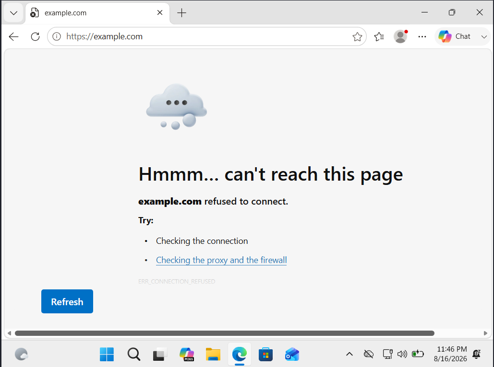
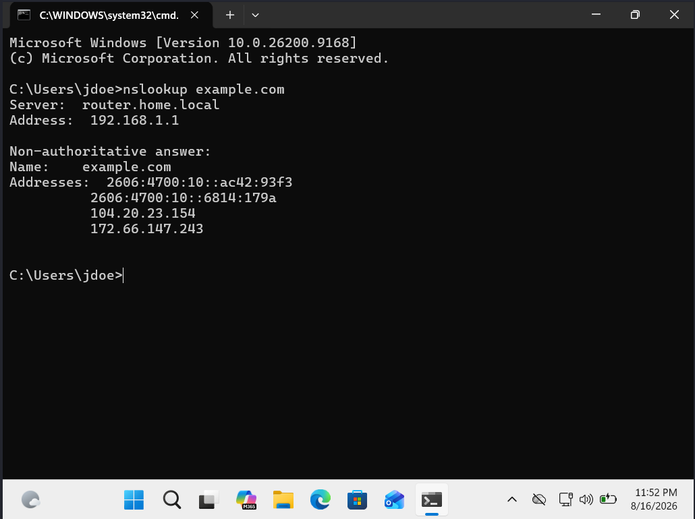
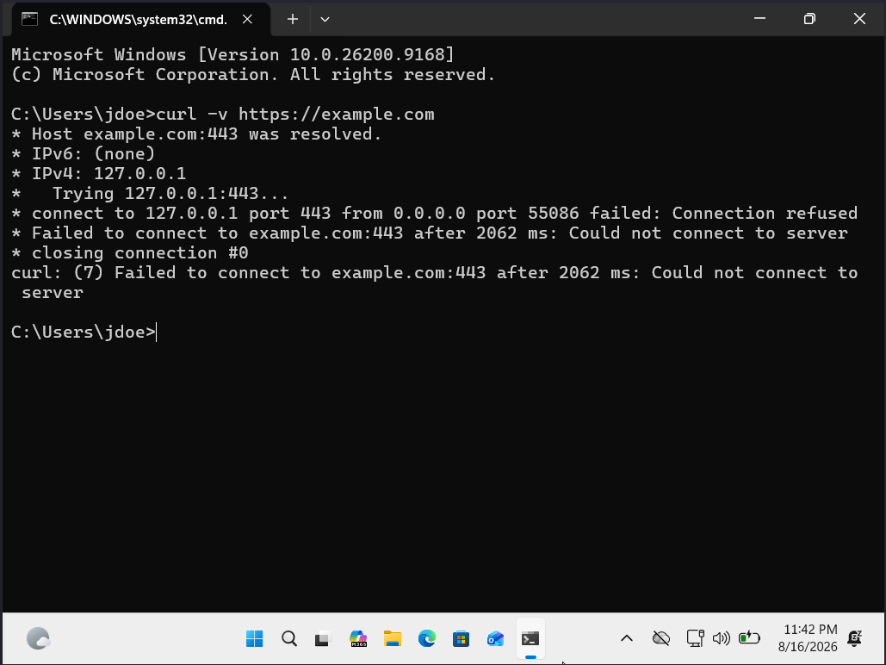
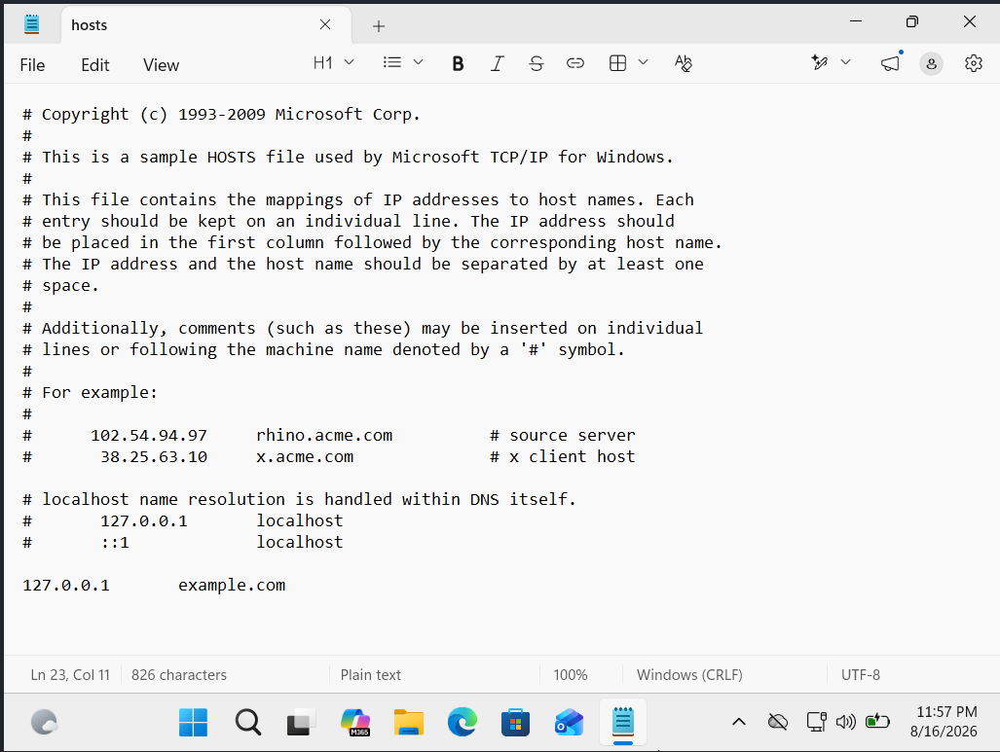
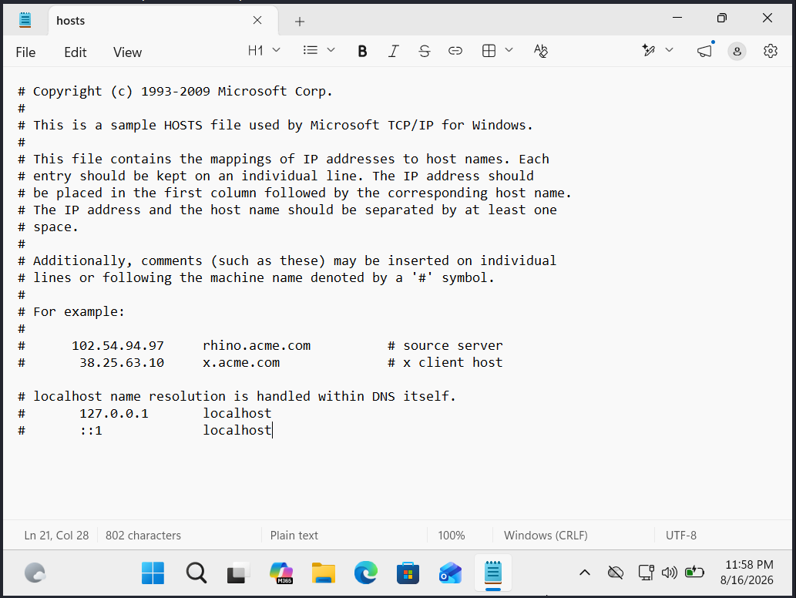
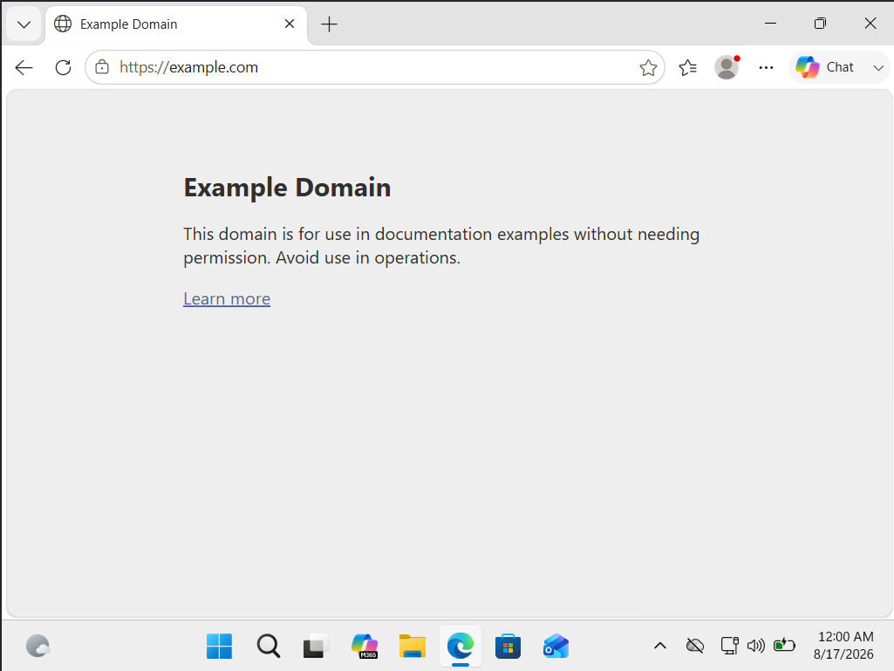
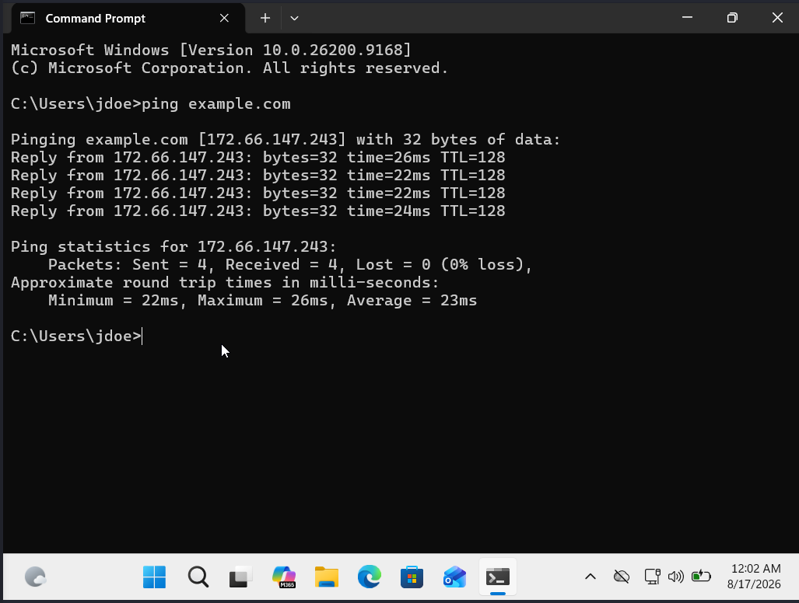

# Ticket 03: Application Access Troubleshooting

## Scenario

A simulated user reports that they can access the internet and other websites, but a specific website ('example.com') is unavailable from their Windows 11 workstation. The goal of this scenario is to isolate the application-specific connectivity issue, identify the root cause, restore access, and verify that the affected website is reachable again.

## Initial Assessment

Because the user reported that other websites remained accessible, I did not initially treat the issue as a general network connectivity failure. Instead, I focused troubleshooting on the affected hostname and how the workstation was resolving and connecting to 'example.com'.

## Observed User Issue

I reproduced the issue by attempting to access 'https://example.com' in Microsoft Edge. The browser returned 'ERR_CONNECTION_REFUSED', confirming that the reported problem could be reproduced on the workstation.

## Troubleshooting Process
### 1. Tested DNS Resolution for the Affected Hostname

Since the issue appeared to affect only 'example.com', I checked how the domain was being resolved using:

'nslookup example.com'

The DNS server returned valid public IP addresses for 'example.com'. This indicated that the DNS server itself was resolving the hostname successfully.

### 2. Tested the Connection Outside the Browser

Although the DNS server returned valid public addresses, the website remained inaccessible. I used 'curl' with verbose output to inspect the connection attempt:

'curl -v https://example.com'

The output showed that the workstation was attempting to connect to 'example.com' using '127.0.0.1' on HTTPS port 443. The connection was refused because the request was being directed back to the local workstation rather than the website's public address.

### 3. Investigated Local Hostname Resolution

Because the DNS server returned valid public IP addresses wile the workstation attempted to connect to '127.0.0.1', I suspected that something on the local system was overriding normal hostname resolution.

I inspected the Windows hosts file located at:

'C:\Windows\System32\drivers\etc\hosts'

The file contained an entry mapping 'example.com' to '127.0.0.1', the IPv4 loopback address.

## Diagnosis

The issue was caused by a local windows hosts file entry mapping 'example.com to '127.0.0.1'. Because '127.0.0.1' is the IPv4 loopback address, connections intended for 'example.com' were being redirected back to the local workstation instead of the website's actual public IP address.

## Resolution

I removed the incorrect '127.0.0.1 example.com' entry from the Windows hosts file and saved the updated configuration. This removed the local hostname override and allowed the workstation to use normal name resolution for 'example.com'.

## Verification

After removing the hosts file override, I retested access to 'https://example.com' in Microsoft Edge. The website loaded successfully, confirming that the original user-facing issue had been resolved.

I also tested hostname resolution from Command Prompt using:

'ping example.com'

The hostname now resolved to a public IP address instead of '127.0.0.1', confirming that the local override was no longer affecting the workstation.

## Key Takeaways
The key factor in my decision-making was the user-provided detail that they were able to access other websites despite being unable to connect to example.com. Listening to and testing the user's information was critical to the troubleshooting process, as it helped eliminate unnecessary diagnostics. This led me to identify a misconfiguration in the hosts file, which was resolved quickly thanks to the information provided by the user.
